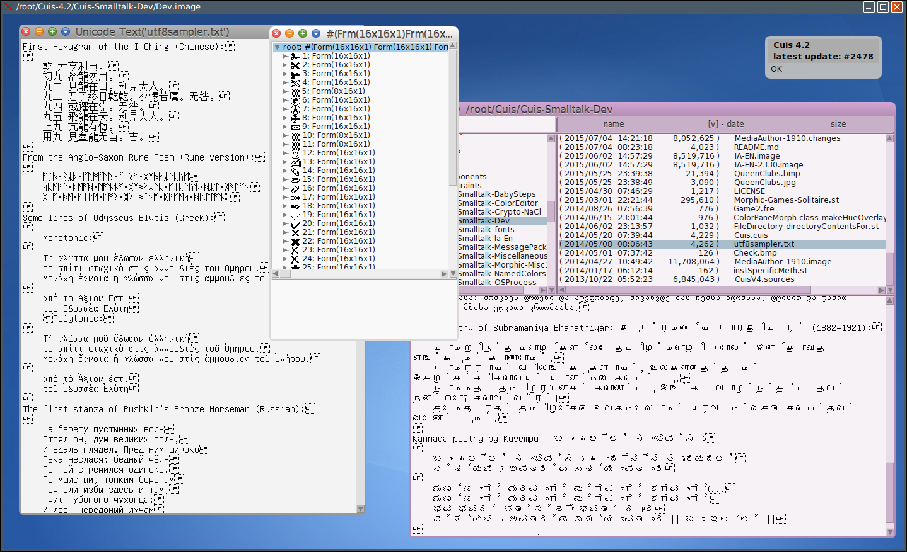

Cuis-Unicode
============

### Aim

Design Sketch showing mechanics for Unicode support. Uses Ropes.
cf https://github.com/KenDickey/Cuis-Smalltalk-Ropes


### Status

Incomplete; Pre-Alpha; Not ready yet to see the light of day...
- Simple edit of Unicode files with copy/cut and paste.
- NO font support (uses simple 'forms' from GNU UniFont).
- Currently, there is NO grapheme composition. Unicode code points are displayed, including 'combining marks'.

- Tested with Cuis 4.2 rev 3319


### Introduction/Overview

Unicode is a complex system and strategy for computer manipulation of character and string information for human language.

The code presented here has very limited ambitions:

- Properly read and write Unicode data to/from disk.
- Allow programattic (code) manipulation of Unicode code points.
- Implement reasonable sorting, searching, and other manipulation of code points.

The support of Unicode text display is minimal.  Fonts are not yet supported.  Bitmap glyphs (16 x 16 forms) are from http://www.unifoundry.com/unifont.html

The basic strategy is as follows:
- The main useful classes are UniChar and UniString.  Others are helper subclasses.
- Unicode text is represented by arrayed blocks of storage where all characters are of the same storage size, but such blocks may be mixed transparently to the user -- you don't have to care.
- Ropes are used to keep the illustion of mixed storage sizes while allowing indexing into text by character location.
  [See https://en.wikipedia.org/wiki/Rope_%28computer_science%29 ]

More on Unicode see http://Unicode.org
Note also Wikipedia Unicode pages and http://site.icu-project.org/docs

This package is separate from Core Cuis.
This means that the class UniChar does not inherit from Character and UniString does not inherit from String.


### For the impatient

Import package and tests -- Unicode data takes a long time to read..
````Smalltalk
 Feature require: #'UniCodesTests'.
````

Try things out.

Find a Unicode file in FileList (e.g. utf8sampler.txt). Select the file name. Right-click and select 'view as Unicode' from the menu.
````Smalltalk
 FileListWindow openUniFileList.
````
Open a text editor on a UniString [Unicode String].  Copy & paste.  Cmd-s to save.
````Smalltalk
 'Some text' asUniString edit.
````
Open a text editor on a file
````Smalltalk
 UniTextEditor fromFile: (UniChar package fullFileName asFileEntry parent pathName, '/utf8sampler.txt').
 UniTextEditor fromUser.  "Puts up a file dialog"
````
Show a 'slice' of unicode character forms in an explorer.
````Smalltalk
 (UniForms sliceStart: 16r2701 size: 40) explore. 
````

Bugs are expected, but please email report to  Ken [dot] Dickey [at] whidbey [dot] com



### The grand plan

- UniCodes	- Basic codepoint support (CodePoints: Characters, Ropes ["strings"])
- UniUtils	- Bidirectional, language/locale based sorting; advanced algorithms
- UniDisplay	- Character composition ; ligatures
- UniInput	- Multilingual text input

Unit tests are in separate packages due to large size:

- UniCodesTests
- UniUtilsTests
- UniDisplayTests
- UniInputTests
